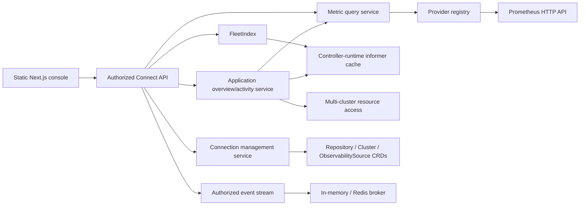

# Paprika Enterprise Operations Console and Observability Sources Design

## Goal

Turn Paprika's existing dashboard into an enterprise operations console for platform and SRE teams managing up to 10,000 applications across 100 clusters. The first tranche delivers scalable fleet visibility, focused application troubleshooting, connection management, and Prometheus-backed golden signals without adding a second source of truth or a general-purpose observability product.

This is the first of three independent product tranches:

1. Enterprise operations console and Prometheus source layer (this design).
2. Native workflow definitions and immutable `PipelineRun` executions.
3. Immutable release bundles coordinating existing per-application `Release` executions.

Each later tranche receives its own design and implementation plan. This tranche must ship as complete, useful software without depending on either later model.

## Product Decisions

- Primary audience: platform engineering and SRE teams. Application teams use the same shell, narrowed by AppProject authorization.
- UI authority: Hybrid GitOps. The UI may execute safe operational actions and manage connections, while application and delivery definitions remain declarative.
- Target scale: 10,000 applications and 100 clusters.
- Product shell: one persistent operations console, not separate products or role-specific workspaces.
- Fleet default: zoomable application treemap, with Matrix and Table/Queue presentations over the same query state.
- Search: built-in fuzzy application-name search. No Elasticsearch/OpenSearch and no natural-language search.
- Metrics: Prometheus is the only concrete v1 adapter. The internal provider contract permits later adapters.
- Metrics UX: opinionated request rate, error rate, latency, and saturation signals. No arbitrary dashboard builder.
- Diagnostics: live/on-demand. No persistent InvestigationRun or incident store in this tranche.
- Architecture: Kubernetes remains the source of truth. API replicas maintain informer-backed indexes; Redis is optional for bounded caches and live-event fan-out/replay.

## Current Foundation to Reuse

Paprika already has most low-level operational evidence:

- A statically exported Next.js 16/React 19 UI served by the Go API process.
- Connect RPC, AppProject authorization, OIDC/basic auth, and live SSE updates.
- Application, Pipeline, Release, Rollout, ApplicationSet, Repository, AppProject, and Cluster CRDs.
- Application sync/health status, resource topology, live and desired manifests, unified diff, Kubernetes events, streaming pod logs, release history, gates, analysis, and deterministic investigations.
- A pipeline DAG detail view and rollout-debugging views.
- OTel metrics/traces/logs export plus the controller-runtime Prometheus endpoint.

The current dashboard's cross-resource search and health tiles are client-side and operate only on already-fetched objects. List APIs are mostly unpaginated and weakly filtered. Repositories, clusters, projects, and metric sources are not exposed through management APIs. The current raw `/events` stream bypasses the Connect authorization interceptor. Resource troubleshooting also uses the API server's local Kubernetes client instead of consistently resolving the application's target cluster.

The new design evolves these foundations rather than duplicating them.

## Information Architecture

### Unified shell

The authenticated console uses a persistent sidebar and a scope bar:

- **Overview** — fleet posture, active change, gates, and prioritized attention.
- **Applications** — full application inventory and fleet visualizations.
- **Pipelines** — existing pipeline inventory and execution detail; authoring/run-history changes are deferred to tranche 2.
- **Releases** — existing per-application release and rollout inventory; coordinated bundles are deferred to tranche 3.
- **Activity** — authorized recent delivery activity across the selected scope.
- **Admin** — Connections, Clusters, Projects, and Policies.

The scope bar carries project, cluster, stage, and namespace between routes. Scope, filters, search, sort, presentation, and zoom are URL encoded so views are refresh-safe and shareable. The first tranche does not add server-stored saved views.

Existing routes remain valid. `/dashboard` renders Overview in the new shell. Existing application, pipeline, rollout, and ApplicationSet deep links continue to resolve and render inside the shell. Hash links such as `/dashboard#applications` redirect to the dedicated inventory route.

### Overview and Applications

Overview and Applications use the same fleet-query contract.

- Treemap is the default presentation. Global view shows every authorized application as a colored cell nested by project; selecting a project or another grouping semantically zooms without changing the active filters.
- Matrix pivots aggregate rows and columns across project, cluster, stage, and health.
- Table/Queue provides the accessible, exact inventory and an impact-ranked attention queue.
- Basic filters cover health, sync status, release/rollout state, stage, project, cluster, namespace, and source type.
- Search supports normalized prefix, substring, and typo-tolerant application-name matching.
- Presentation changes preserve selection, filters, scope, search, and zoom.

Overview adds aggregate health, active deployments, blocked gates, source/cluster connection failures, and highest-impact unhealthy applications. Applications prioritizes inventory operations, sorting, and drill-down.

Treemap size defaults to managed-resource count because it is always available and deterministic. When a Prometheus source supplies request rate, users may switch size to traffic. Color defaults to composite application health. Health is never conveyed by color alone.

### Application workspace

Application detail becomes a tabbed operations workspace with a persistent identity/action header. The selected stage and cluster are URL state; the current stage is the default.

- **Overview** — correlated change-and-health timeline, golden signals, current release/rollout, resource posture, top investigation findings, gates, and safe actions.
- **Resources** — topology/list presentations, resource selection, live/desired manifests, diff, events, and streaming logs.
- **Diagnostics** — the existing deterministic investigator, ranked findings, evidence, and playbooks. Results remain on-demand and are not persisted.
- **Metrics** — opinionated golden-signal charts, source status, time-range selection, and rollout-analysis results.
- **Releases** — release history, policy/gate/hook state, version comparison, rollback, and rollout drill-down.
- **Activity** — expanded chronological delivery activity.
- **Configuration** — read-only effective application/source/stage/sync configuration and links to the declarative source.

Overview leads with the timeline because the first operational question is usually “what changed?”. Deep Kubernetes topology remains a focused Resources workflow rather than the entire page's organizing model.

## Architecture



### FleetIndex

`FleetIndex` is a read-only, process-local projection fed by the API server's existing informer cache. It has no persistence and performs no live Kubernetes reads on the query hot path.

It owns:

- An application-summary map keyed by namespace/name.
- Exact inverted indexes for project, namespace, cluster, stage, source type, health, sync, release, and rollout state.
- A normalized trigram posting index for fuzzy application-name candidates.
- Aggregate counters used for facets and fleet-map responses.
- A monotonically increasing in-memory generation for diagnostics and cache invalidation.

Application, Release, Rollout, Stage, Cluster, and Repository informer events update affected summaries incrementally. A full rebuild is allowed only at startup/cache resync. Queries return `Unavailable` until informer synchronization and the initial index build complete.

Authorization is applied before facets or aggregates are calculated, preventing unauthorized project counts or names from leaking. The request-scoped authorized-project set is computed once and passed into the index query.

Cursor pagination is live rather than snapshot-isolated. The opaque cursor contains the query hash and the last deterministic sort tuple, with namespace/name as the final tie-breaker. Using a cursor with different filters or search returns `InvalidArgument`. Concurrent updates may move an item between pages, but never authorize an otherwise hidden item.

### Fleet query API

Add these Connect RPCs to `PaprikaService`:

```proto
rpc QueryApplications(QueryApplicationsRequest) returns (QueryApplicationsResponse);
rpc QueryFleetMap(QueryFleetMapRequest) returns (QueryFleetMapResponse);
rpc GetApplicationOverview(GetApplicationOverviewRequest) returns (GetApplicationOverviewResponse);
rpc ListApplicationActivity(ListApplicationActivityRequest) returns (ListApplicationActivityResponse);
rpc QueryApplicationSignals(QueryApplicationSignalsRequest) returns (QueryApplicationSignalsResponse);
rpc WatchEvents(WatchEventsRequest) returns (stream WatchEvent);
```

`QueryApplicationsRequest` carries repeated project, namespace, cluster, stage, health, sync, release-state, rollout-state, and source-type filters; normalized name search; sort field/direction; page size; and opaque cursor. Page size defaults to 100 and is capped at 500.

`QueryApplicationsResponse` contains compact `ApplicationSummary` records, total authorized count, next cursor, index generation, and facet buckets. Summary records include identity, project, current stage/cluster, source type/revision, health, sync/drift counts, current release/rollout state, resource count, last transition, and explicit capabilities.

`QueryFleetMapRequest` uses the same filter structure plus group dimension and size metric. The response is a hierarchy of aggregate and application leaf nodes with health buckets, counts, weights, and stable IDs. Presentation is a client concern and does not alter the API result semantics.

The existing `ListApplications` and related RPCs remain compatible. New pages use the query RPCs; old clients can continue using existing calls.

### Application overview and activity

`GetApplicationOverview` returns only cheap current-state synthesis: application summary, latest releases/rollout, gates, resource posture, provider availability, and capabilities. Deep resource data, logs, investigation, and metric ranges remain lazy per tab.

`ListApplicationActivity` constructs a bounded on-demand timeline from:

- Application and Release conditions.
- Recent Releases and promotion history.
- Current Pipeline timestamps and artifacts available in the existing model.
- Rollout transitions, analysis, gates, and hook statuses.
- Recent Kubernetes events from the selected target cluster.

Metric series are rendered on the same time axis but are not converted into durable activity records. Results are sorted by timestamp and deduplicated using a stable source/resource/reason/timestamp key. Default range is 24 hours, maximum range is 30 days, and default page size is 100.

### Multi-cluster resource access

Introduce an `ApplicationResourceGateway` used by resource, event, log, investigation, and activity handlers. It resolves the selected Application stage to its Cluster and then chooses:

- The existing pooled client for in-cluster or direct clusters.
- The existing agent transport for agent-managed clusters, extended with read-manifest, event, and streaming-log operations.

Authorization occurs before target-cluster resolution. A cluster connection error degrades only the affected application section and includes cluster identity, last known health, and a retryable error. The API must never silently fall back to the control-plane cluster.

### UI data layer

The UI remains a static export and same-origin Connect client. Add TanStack Query for request caching/invalidation and TanStack Virtual for large tables. A single URL-query codec owns scope, filters, search, sort, presentation, time range, and zoom; pages do not maintain divergent copies.

Treemap layout uses `d3-hierarchy` and Canvas rendering so 10,000 cells do not create 10,000 interactive DOM elements. Hit testing, tooltips, selection, and spatial arrow-key navigation use the calculated cell bounds. A synchronized virtualized table provides a complete semantic and keyboard-accessible equivalent.

Live events invalidate the smallest relevant TanStack Query key. Periodic bounded refetch remains a backstop when the stream reconnects or reports a replay gap.

## Observability Sources

### CRD

Add namespaced `observability.paprika.io/v1alpha1 ObservabilitySource`:

```yaml
spec:
  provider: prometheus
  endpoint: https://prometheus.example.com
  secretRef:
    name: prometheus-credentials
  tls:
    caSecretRef: prometheus-ca
    serverName: prometheus.example.com
    insecureSkipVerify: false
  query:
    timeoutSeconds: 5
    maxConcurrent: 4
    maxSeries: 200
  correlation:
    applicationLabel: app_paprika_io_name
    namespaceLabel: namespace
    projectLabel: app_paprika_io_project
    clusterLabel: cluster
    stageLabel: stage
  goldenSignals:
    requestRate: 'sum(rate(http_server_request_duration_seconds_count{...}[${window}]))'
    errorRate: 'sum(rate(http_server_request_duration_seconds_count{status_code=~"5..",...}[${window}])) / ...'
    latencyP95: 'histogram_quantile(0.95, sum by (le) (rate(http_server_request_duration_seconds_bucket{...}[${window}])))'
    saturation: 'max(container_cpu_usage_seconds_total{...}) / ...'
status:
  phase: Healthy
  observedGeneration: 1
  capabilities: [instant, range]
  lastCheckedAt: "..."
  responseTime: 42ms
  message: connected
```

The concrete schema uses typed nested structs, enums, bounds, Secret references, and metav1 conditions. PromQL templates are administrator configuration, not end-user dashboard input. Only documented variables (`application`, `namespace`, `project`, `cluster`, `stage`, `window`) are accepted. The controller validates template parsing and variables before reporting Healthy.

An AppProject may use sources in its namespace. Cross-namespace source references are rejected in v1.

### Provider boundary

Keep Paprika's own OTel emission separate from querying external telemetry. Add an injected internal registry:

```go
type MetricProvider interface {
    Health(ctx context.Context) (ProviderHealth, error)
    QueryInstant(ctx context.Context, req SignalRequest) (SignalResult, error)
    QueryRange(ctx context.Context, req SignalRequest) (SignalResult, error)
}

type MetricProviderFactory interface {
    ProviderType() string
    New(ctx context.Context, source ObservabilitySource, credentials Credentials) (MetricProvider, error)
}
```

The first factory implements the Prometheus HTTP API. Later providers are compiled adapters or versioned RPC integrations, not Go runtime plugins.

`SignalRequest` contains source identity, authorized application correlation, signal enum, start/end/step, and window. `SignalResult` normalizes scalar and time-series values, labels, unit, source timestamp, warnings, and freshness. The browser cannot submit raw PromQL.

Provider clients are cached by source UID/resourceVersion and Secret resourceVersion. Query results use a bounded TTL cache and singleflight keyed by provider, signal, correlation, and time range. Source or Secret changes invalidate clients and results. Dashboard callers receive partial results; one failed signal does not discard successful signals.

### Security and limits

- Only HTTP(S) Prometheus endpoints are accepted; production defaults require TLS.
- Credentials attach only to the configured origin. Cross-origin redirects are rejected.
- Timeout defaults to 5 seconds and is capped at 30 seconds.
- Concurrency defaults to 4 queries per source.
- Results default to 200 series maximum and are truncated with an explicit warning.
- Query range and step are clamped server-side.
- Source access is authorized before template expansion or network access.
- Endpoints, signals, latency, result counts, and failures are audited; credentials and expanded sensitive headers are never logged.

### Golden signals and rollout analysis

`QueryApplicationSignals` accepts an Application, source reference, signal enums, and time range. It returns normalized golden signals and per-signal errors/freshness.

Extend `AnalysisCheck` with `type: metric` and a typed `MetricAnalysisCheck` containing source reference, signal enum, comparator, numeric threshold, window, and no-data policy. The default no-data/provider-error policy is `Error`.

- Dashboard metric errors are informational and render unavailable/stale states.
- Required rollout checks that cannot query or return no data move AnalysisRun to `Error` and pause promotion.
- Threshold failure follows the existing configured failure action.
- No metric error silently passes and no provider error directly triggers an automatic rollback.

The unsafe existing `latencyP99` behavior that assumes success when metrics are unavailable is removed. Existing `podMetrics` checks remain readable for compatibility but produce an explicit error when their required data source is unavailable.

### Investigator integration

Refactor the existing investigator registry so collected `DataSource` evidence is included in detector input. Register a metric evidence source that requests the four normalized golden signals for the target Application. Provider errors appear as source warnings and do not suppress Kubernetes findings. No Prometheus-specific type leaks into detector interfaces.

## Connection Management

Admin exposes:

- Git and Helm Repositories.
- OCI Repositories, presented as Registries in the UI.
- Clusters.
- Observability Sources.
- Read-only AppProjects and Policies.

Add authorized list/get/create/update/delete/test RPCs for Repository, Cluster, and ObservabilitySource. These RPCs map to the existing/new CRDs and use resourceVersion preconditions for updates and deletes. Test RPCs perform a bounded live connection check without mutating status; controllers remain responsible for durable connection status.

Connection forms may reference an existing Secret or create/rotate a connection-owned Secret. Submitted credentials are write-only. Responses return only the Secret name and configured authentication kind. UI-created Secrets are labeled and owner-referenced to their connection; externally supplied Secrets are never modified or deleted. Deleting a connection cascades only an owned credential Secret.

The first tranche does not edit AppProject roles, global RBAC, policies, notifications, templates, or arbitrary Kubernetes Secrets.

## Authorization, Capabilities, Audit, and Live Events

Every read, facet, aggregate, metric query, stream subscription, and mutation is filtered through global RBAC plus AppProject authorization. Requests that omit a project do not bypass project authorization; the server calculates the caller's authorized project set.

Summary and detail responses include explicit capabilities such as `application.sync`, `release.rollback`, `gate.approve`, `pipeline.retry`, `connection.write`, and `connection.test`. The UI uses capabilities for presentation, but handlers still enforce authorization independently.

Replace the raw dashboard EventSource endpoint with `WatchEvents`, an authorized Connect server-streaming RPC. Requests specify resource/topic filters and an optional last sequence. Each event has a monotonic topic sequence and authorization metadata.

The broker retains at most 1,000 events or five minutes per topic in memory, with Redis providing the same bounded replay and cross-replica fan-out when configured. If the requested cursor is unavailable, the stream emits `reset_required`; the UI refetches affected query keys. This is reconnection support, not a durable event history.

All management mutations, operational actions, analysis decisions, and metric source queries emit structured audit records with actor, project, resource, action, outcome, and correlation ID.

## Failure and Empty States

- A page remains usable when one section or provider fails.
- Every stale response shows its source timestamp and reason.
- “No data”, “not configured”, “unauthorized”, “cluster unreachable”, and numeric zero are distinct states.
- Initial cache synchronization returns a retryable loading state, not an empty fleet.
- A removed or unauthorized filter value is dropped with a visible notice.
- Cursor invalidation restarts at page one while preserving filters and sort.
- Target-cluster failures never fall back to a different cluster.
- Destructive actions require typed confirmation for high-blast-radius operations and show the exact affected scope.

## Accessibility and Responsive Behavior

- Status always has text/icon semantics in addition to color.
- Treemap cells expose tooltips, focus state, and spatial keyboard navigation; the table view exposes identical records and actions.
- Focus is preserved when filters or presentation change where the selected Application remains visible.
- Reduced-motion preferences disable layout and status animations.
- The desktop sidebar becomes a keyboard-accessible drawer on narrow screens; operational tables remain horizontally scrollable rather than dropping critical columns.
- Loading, error, empty, stale, and partial-success states are announced through appropriate live regions without excessive repetition.

## Observability of the Feature

New server code uses the existing OTel meter/tracer and Prometheus exporter. Add metrics and spans for:

- Fleet-index build/update duration, item count, and generation.
- Fleet query duration, result count, filters, and cache outcome.
- Provider health, query duration, error type, series count, truncation, and cache outcome.
- Event-stream connections, replay success/gap, and reset requests.
- Multi-cluster resource/log/event request duration and failures.

Do not add new direct-Prometheus instruments.

## Testing and Acceptance

### Backend and contracts

- Unit tests for exact filters, combined filters, fuzzy ranking, authorization-before-aggregation, deterministic sorting, cursor validation, and concurrent index updates.
- Provider conformance suite covering health, instant/range normalization, timeouts, cancellation, partial results, series caps, redirects, TLS, credential rotation, and source deletion.
- Envtest coverage for ObservabilitySource validation, status reconciliation, AppProject boundaries, connection CRUD preconditions, and owned/external Secret lifecycle.
- API tests proving unauthorized applications never influence results or facet counts and unauthorized sources never cause outbound calls.
- Analysis tests proving pass, threshold fail, no data, provider error, and recovery; unavailable latency metrics must never pass implicitly.
- Broker tests for authorization, ordered delivery, bounded replay, gap reset, Redis fan-out, and reconnect behavior.
- Multi-cluster tests proving resource, event, log, and investigation calls target the selected direct/agent cluster and never the control-plane fallback.

### UI

- Component tests for the unified shell, URL query codec, basic filters, fuzzy search, presentation switching, semantic zoom, virtualized inventory, capability-gated actions, partial errors, stale/no-data distinctions, and application tabs/timeline.
- Accessibility tests for color-independent status, focus restoration, treemap keyboard navigation, live regions, reduced motion, and responsive navigation.
- Existing dashboard, application, pipeline, release, rollout, diff, log, and investigator tests are migrated rather than deleted.

### End to end

Add a real Playwright suite; the package is already installed but unused. It covers:

1. OIDC/basic login fixture and authorized shell navigation.
2. Fleet filtering and fuzzy name search.
3. Treemap → Matrix → Table state preservation and Application drill-down.
4. Target-cluster resource inspection, diff, event, and streaming-log flow.
5. Repository/Registry/Cluster/Prometheus source creation, credential rotation, test, and redaction.
6. Golden-signal rendering, provider partial failure, and recovery.
7. Metric-backed rollout gate pass, threshold fail, provider error/pause, and retry.

The kind E2E environment includes Prometheus plus seeded healthy, degraded, drifting, deploying, and gated Applications. Browser E2E runs against the compiled static UI and Go API, not mocked transports.

### Scale acceptance

On an agreed CI reference machine with 10,000 indexed Applications and 100 Clusters:

- Cached filter/search API latency is below 300 ms p95.
- Initial fleet query plus treemap rendering is below two seconds p95.
- Presentation switching after data load is below 250 ms p95.
- API memory remains bounded and is recorded as a benchmark baseline.
- A Prometheus outage does not prevent fleet inventory, resource inspection, or non-metric operational actions.

## Rollout and Compatibility

Implementation order within this tranche:

1. Add query contracts, FleetIndex, authorization fixes, capabilities, and benchmarks.
2. Add the unified shell, Overview, Applications inventory, treemap/Matrix/Table, and browser test harness.
3. Refactor application workspace and multi-cluster resource access.
4. Add ObservabilitySource, Prometheus provider, golden signals, analysis integration, and investigator evidence.
5. Add connection management, authorized WatchEvents, audit coverage, and complete E2E/scale validation.

All protobuf/CRD changes are additive. Existing Connect RPCs, CRDs, CLI behavior, and deep links remain operational. Observability features are absent—not failed—until a source is configured. No data migration or new primary datastore is required.

## Explicit Non-Goals

- Elasticsearch/OpenSearch or a persistent UI read database.
- Natural-language search or AI-generated filters.
- Arbitrary PromQL in the browser or a custom dashboard builder.
- External log/trace providers or a full observability suite.
- Persistent investigations/incidents.
- Full project, RBAC, policy, notification, or template editing.
- Workflow visual authoring, immutable PipelineRuns, or external CI federation.
- Coordinated ReleaseBundles or release trains.

Those workflow and release capabilities remain follow-on tranches with separate approved designs and plans.
