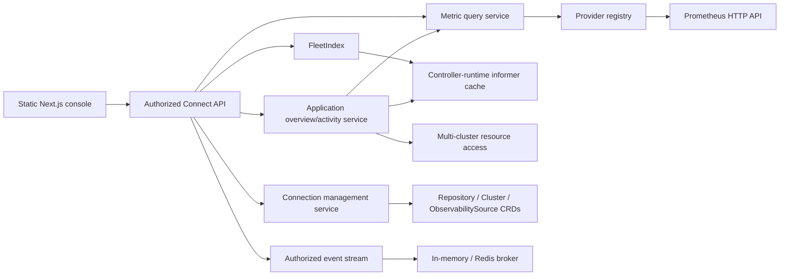

# Paprika Enterprise Operations Console and Observability Sources Design

## Goal

Turn Paprika's existing dashboard into an enterprise operations console for platform and SRE teams managing up to 10,000 applications across 100 clusters. The first tranche delivers scalable fleet visibility, focused application troubleshooting, connection management, and Prometheus-backed golden signals without adding a second source of truth or a general-purpose observability product.

This is the first of three independent product tranches:

1. Enterprise operations console and Prometheus source layer (this design).
2. Native workflow definitions and immutable `PipelineRun` executions.
3. Immutable release bundles coordinating existing per-application `Release` executions.

Each later tranche receives its own design and implementation plan. This tranche must ship as complete, useful software without depending on either later model.

## Product Decisions

- Primary audience: platform engineering and SRE teams. Application teams use the same shell, narrowed by AppProject authorization.
- UI authority: Hybrid GitOps. The UI may execute safe operational actions and manage connections, while application and delivery definitions remain declarative.
- Target scale: 10,000 applications and 100 clusters.
- Product shell: one persistent operations console, not separate products or role-specific workspaces.
- Fleet default: zoomable application treemap, with Matrix and Table/Queue presentations over the same query state.
- Search: built-in fuzzy application-name search. No Elasticsearch/OpenSearch and no natural-language search.
- Metrics: Prometheus is the only concrete v1 adapter. The internal provider contract permits later adapters.
- Metrics UX: opinionated request rate, error rate, latency, and saturation signals. No arbitrary dashboard builder.
- Diagnostics: live/on-demand. No persistent InvestigationRun or incident store in this tranche.
- Architecture: Kubernetes remains the source of truth. API replicas maintain informer-backed indexes; Redis is optional for bounded caches and live-event fan-out/replay.

## Current Foundation to Reuse

Paprika already has most low-level operational evidence:

- A statically exported Next.js 16/React 19 UI served by the Go API process.
- Connect RPC, AppProject authorization, OIDC/basic auth, and live SSE updates.
- Application, Pipeline, Release, Rollout, ApplicationSet, Repository, AppProject, and Cluster CRDs.
- Application sync/health status, resource topology, live and desired manifests, unified diff, Kubernetes events, streaming pod logs, release history, gates, analysis, and deterministic investigations.
- A pipeline DAG detail view and rollout-debugging views.
- OTel metrics/traces/logs export plus the controller-runtime Prometheus endpoint.

The current dashboard's cross-resource search and health tiles are client-side and operate only on already-fetched objects. List APIs are mostly unpaginated and weakly filtered. Repositories, clusters, projects, and metric sources are not exposed through management APIs. The current raw `/events` stream bypasses the Connect authorization interceptor. Resource troubleshooting also uses the API server's local Kubernetes client instead of consistently resolving the application's target cluster.

The new design evolves these foundations rather than duplicating them.

## Information Architecture

### Unified shell

The authenticated console uses a persistent sidebar and a scope bar:

- **Overview** — fleet posture, active change, gates, and prioritized attention.
- **Applications** — full application inventory and fleet visualizations.
- **Pipelines** — existing pipeline inventory and execution detail; authoring/run-history changes are deferred to tranche 2.
- **Releases** — existing per-application release and rollout inventory; coordinated bundles are deferred to tranche 3.
- **Activity** — authorized recent delivery activity across the selected scope.
- **Admin** — Connections, Clusters, Projects, and Policies.

The scope bar carries project, cluster, stage, and namespace between routes. Scope, filters, search, sort, presentation, and zoom are URL encoded so views are refresh-safe and shareable. The first tranche does not add server-stored saved views.

Existing routes remain valid. `/dashboard` renders Overview in the new shell. Existing application, pipeline, rollout, and ApplicationSet deep links continue to resolve and render inside the shell. Hash links such as `/dashboard#applications` redirect to the dedicated inventory route.

### Overview and Applications

Overview and Applications use the same fleet-query contract.

- Treemap is the default presentation. Global view shows every authorized application as a colored cell nested by project; selecting a project or another grouping semantically zooms without changing the active filters.
- Matrix pivots aggregate rows and columns across project, cluster, stage, and health.
- Table/Queue provides the accessible, exact inventory and an impact-ranked attention queue.
- Basic filters cover health, sync status, release/rollout state, stage, project, cluster, namespace, and source type.
- Search supports normalized prefix, substring, and typo-tolerant application-name matching.
- Presentation changes preserve selection, filters, scope, search, and zoom.

Overview adds aggregate health, active deployments, blocked gates, source/cluster connection failures, and highest-impact unhealthy applications. Applications prioritizes inventory operations, sorting, and drill-down.

Treemap size defaults to managed-resource count because it is always available and deterministic. When a Prometheus source supplies request rate, users may switch size to traffic. Color defaults to composite application health. Health is never conveyed by color alone.

### Application workspace

Application detail becomes a tabbed operations workspace with a persistent identity/action header. The selected stage is URL state; the runtime cluster is derived from that stage and displayed read-only. The current stage is the default.

- **Overview** — correlated change-and-health timeline, golden signals, current release/rollout, resource posture, top investigation findings, gates, and safe actions.
- **Resources** — topology/list presentations, resource selection, live/desired manifests, diff, events, and streaming logs.
- **Diagnostics** — the existing deterministic investigator, ranked findings, evidence, and playbooks. Results remain on-demand and are not persisted.
- **Metrics** — opinionated golden-signal charts, source status, time-range selection, and rollout-analysis results.
- **Releases** — release history, policy/gate/hook state, version comparison, rollback, and rollout drill-down.
- **Activity** — expanded chronological delivery activity.
- **Configuration** — read-only effective application/source/stage/sync configuration and links to the declarative source.

Overview leads with the timeline because the first operational question is usually “what changed?”. Deep Kubernetes topology remains a focused Resources workflow rather than the entire page's organizing model.

## Architecture



### FleetIndex

`FleetIndex` is a read-only, process-local projection fed by the API server's existing informer cache. It has no persistence and performs no live Kubernetes reads on the query hot path.

The index receives an explicit `InformerSource` dependency rather than discovering a cache through `client.Client`:

- In operator mode, `mgr.GetCache()` is injected and `FleetIndex` is registered as a manager `Runnable` before `mgr.Start`.
- In standalone API mode, cache construction returns both the controller-runtime cache and cache-backed client. Informer handlers are registered before the cache starts; cache sync, initial index build, and HTTP readiness complete in that order.
- `FleetIndex.Start(ctx)` owns its update workers and shuts them down when the process context is cancelled. Readiness is false until every required informer has synced and the initial atomic snapshot is installed.
- `--api-cache-enabled=false` remains an emergency legacy-API mode. The process serves existing RPCs, but enterprise query RPCs return `Unavailable` with the configuration reason and the console shows a configuration error instead of an empty fleet. The Helm chart keeps the cache enabled.

It owns:

- An application-summary map keyed by namespace/name.
- Exact inverted indexes for project, namespace, cluster, stage, source type, health, sync, release, and rollout state.
- A normalized trigram posting index for fuzzy application-name candidates.
- Aggregate counters used for facets and fleet-map responses.
- A monotonically increasing in-memory generation for diagnostics and cache invalidation.

Application, Release, Rollout, Stage, Cluster, Repository, AppProject, and ObservabilitySource informer events update affected summaries incrementally. The API cache's required warm-object set includes all of them. Reverse dependencies map project→Applications and source→Applications, so project default-source, source binding, and source status changes recompute affected summaries. Secret events invalidate provider clients/results but do not expose Secret data through FleetIndex. A full rebuild is allowed only at startup/cache resync. Queries return `Unavailable` until informer synchronization and the initial index build complete.

Authorization is applied before facets or aggregates are calculated, preventing unauthorized project counts or names from leaking. The request-scoped authorized-project set is computed once and passed into the index query.

Full rebuilds construct a replacement snapshot while queueing informer deltas, apply the queued deltas, and then swap the snapshot atomically. A failed rebuild leaves the previous ready snapshot in service and reports degraded readiness/metrics.

Cursor pagination is live rather than snapshot-isolated. The replica-independent, versioned opaque cursor contains the query hash and last deterministic sort tuple, with namespace/name as the final tie-breaker. It deliberately contains no process-local generation or epoch, so any API replica can serve the next page. Unknown cursor schema versions or a different query hash return `InvalidArgument` and the UI restarts at page one. Concurrent updates or replica cache skew may move an item between pages, but never authorize an otherwise hidden item; clients de-duplicate identities while paging.

Filter values are ORed within a dimension and dimensions are ANDed together. Stage and cluster filters match any `StageTargetSummary` for the Application; current-stage/current-cluster remain separate summary fields. Facet counts apply search and every active filter except the facet's own dimension, enabling users to widen or narrow that dimension without losing the rest of the query.

Name search normalizes Unicode to NFKC, lowercases, trims, and treats `-`, `_`, `.`, and repeated whitespace as equivalent separators. Ranking is exact, prefix, substring, then trigram similarity; trigram candidates below 0.3 are excluded. Sort ties always resolve by namespace/name. Search input is capped at 128 characters.

### Fleet query API

Add these Connect RPCs to `PaprikaService`:

```proto
rpc QueryApplications(QueryApplicationsRequest) returns (QueryApplicationsResponse);
rpc QueryFleetMap(QueryFleetMapRequest) returns (QueryFleetMapResponse);
rpc QueryFleetMatrix(QueryFleetMatrixRequest) returns (QueryFleetMatrixResponse);
rpc GetApplicationOverview(GetApplicationOverviewRequest) returns (GetApplicationOverviewResponse);
rpc ListApplicationActivity(ListApplicationActivityRequest) returns (ListApplicationActivityResponse);
rpc QueryActivity(QueryActivityRequest) returns (QueryActivityResponse);
rpc QueryApplicationSignals(QueryApplicationSignalsRequest) returns (QueryApplicationSignalsResponse);
rpc ListAppProjects(ListAppProjectsRequest) returns (ListAppProjectsResponse);
rpc GetAppProject(GetAppProjectRequest) returns (GetAppProjectResponse);
rpc WatchEvents(WatchEventsRequest) returns (stream WatchEvent);
```

`QueryApplicationsRequest` carries repeated project, namespace, cluster, stage, health, sync, release-state, rollout-state, and source-type filters; normalized name search; sort field/direction; page size; and opaque cursor. Page size defaults to 100 and is capped at 500.

`QueryApplicationsResponse` contains compact `ApplicationSummary` records, total authorized count, next cursor, index generation, and facet buckets. Summary records include identity, project, repeated `StageTargetSummary` entries, current stage/cluster, source type/revision, health, sync/drift counts, current release/rollout state, resource count, last transition, effective observability source, and explicit capabilities.

`QueryFleetMapRequest` uses the same filter structure plus group dimension and size metric. The response is a hierarchy of aggregate and application leaf nodes with health buckets, counts, weights, and stable IDs. Presentation is a client concern and does not alter the API result semantics.

`QueryFleetMatrixRequest` uses the same filters plus independent row and column dimensions. It returns ordered row/column headers and sparse aggregate cells. Row and column cannot be the same dimension. Matrix is not inferred from the single-dimension treemap hierarchy.

Matrix aggregation never creates a cross-product of multi-valued stages and clusters. If neither axis is stage/cluster, each Application contributes once using overall health. If either axis is stage or cluster, the engine projects the Application into its actual `StageTargetSummary` records and each real stage→cluster pair contributes once; the other axis value is copied onto that record. Cells return both unique `application_count` and `target_count`, and stage health comes from the matching `Application.status.stages` entry or Unknown. Thus Stage×Cluster counts actual deployment targets, while Project×Health counts Applications.

The existing `ListApplications` and related RPCs remain compatible. New pages use the query RPCs; old clients can continue using existing calls.

### Application overview and activity

`GetApplicationOverview` returns only cheap current-state synthesis: application summary, latest releases/rollout, gates, resource posture, provider availability, and capabilities. Deep resource data, logs, investigation, and metric ranges remain lazy per tab.

`ListApplicationActivity` and global `QueryActivity` construct bounded on-demand timelines from:

- Application and Release conditions.
- Recent Releases and promotion history.
- Current Pipeline timestamps and artifacts available in the existing model.
- Rollout transitions, analysis, gates, and hook statuses.
- Recent Kubernetes events from the selected target cluster.

Metric series are rendered on the same time axis but are not converted into durable activity records. Results are sorted by timestamp and deduplicated using a stable source/resource/reason/timestamp key. Default range is two hours, maximum range is seven days, and default page size is 100.

`QueryActivity` accepts the common authorized fleet scope plus resource type, outcome, and time filters. It returns the same normalized activity item and cursor contract as the application timeline. Both responses include per-source `ActivityCoverage` with earliest/latest available timestamp and `complete`/`best_effort` status. Release/condition history can be complete for retained CRs; Kubernetes Events and current Pipeline status are explicitly best effort. The UI never describes this view as an audit log or promises history beyond reported coverage.

### Multi-cluster resource access

Introduce an `ApplicationResourceGateway` used by resource, event, log, investigation, and activity handlers. Application workspace state contains a stage name only; cluster is derived and cannot be independently overridden.

Stage resolution is deterministic:

1. Default to `Application.status.currentStage`; if empty, use the lowest `(ring, name)` entry in `Application.spec.stages`.
2. Validate the selected name exists in `Application.spec.stages`.
3. Resolve the runtime Stage CR named `<application-name>-<stage-name>` in the Application namespace.
4. Require the Stage CR controller owner UID and `app.paprika.io/name` label to match the Application and require `Stage.spec.name` to match the selected stage.
5. Use `Stage.spec.cluster` as the authoritative runtime target because Releases deploy through that object. A missing or inconsistent Stage makes resource operations unavailable; the server never guesses from another stage or cluster.

`Stage.spec.cluster` has one unambiguous connection mode:

- When `ClusterRef.name` is non-empty, it is a strict reference to `clusters.paprika.io/Cluster` at `ClusterRef.namespace` or the Stage namespace by default. Inline `server`, `mode`, `agentAddress`, `kubeconfigSecret`, and `serviceAccount` fields must be empty. Missing, Disabled, or Unhealthy Cluster CRs fail resolution. The resolved Cluster spec/status determines mode, server, credential Secret, service account, and agent address.
- When name is empty and every inline connection field is empty, the target is the control-plane in-cluster connection.
- Existing name-empty inline connection fields remain a deprecated legacy form and are not managed by the Clusters UI. New or changed Stages cannot introduce that form; unchanged legacy objects continue to resolve through the compatibility adapter and are marked “unmanaged inline cluster”.

The shared resolver used by Release deployment, governance validation, and `ApplicationResourceGateway` adopts these rules; the current behavior that silently retains inline fields when a named Cluster is missing is removed. Named Cluster deletion dependency checks cover only strict name references. Cluster Secret namespace comes from `Cluster.spec.kubeconfigSecretRef`, never from Stage reference namespace.

After resolution, the gateway chooses:

- The existing pooled client for in-cluster or direct clusters.
- The existing agent transport for agent-managed clusters, extended with read-manifest, event, and streaming-log operations.

Authorization occurs before target-cluster resolution. A cluster connection error degrades only the affected application section and includes cluster identity, last known health, and a retryable error. The API must never silently fall back to the control-plane cluster.

### UI data layer

The UI remains a static export and same-origin Connect client. Add TanStack Query for request caching/invalidation and TanStack Virtual for large tables. A single URL-query codec owns scope, filters, search, sort, presentation, time range, and zoom; pages do not maintain divergent copies.

Treemap layout uses `d3-hierarchy` and Canvas rendering so 10,000 cells do not create 10,000 interactive DOM elements. Hit testing, tooltips, selection, and spatial arrow-key navigation use the calculated cell bounds. A synchronized virtualized table provides a complete semantic and keyboard-accessible equivalent.

Live events invalidate the smallest relevant TanStack Query key. Periodic bounded refetch remains a backstop when the stream reconnects or reports a replay gap.

## Observability Sources

### CRD

Add namespaced `observability.paprika.io/v1alpha1 ObservabilitySource`:

```yaml
spec:
  projectRef: platform
  provider: prometheus
  endpoint: https://prometheus.example.com
  auth:
    type: bearer
    secretRef:
      name: prometheus-credentials
  tls:
    caSecretRef: prometheus-ca
    serverName: prometheus.example.com
    insecureSkipVerify: false
  query:
    timeoutSeconds: 5
    maxConcurrent: 4
    maxSeries: 200
    rateLimitPerMinute: 30
  scope:
    mode: label
  correlation:
    applicationLabel: app_paprika_io_name
    namespaceLabel: namespace
    projectLabel: app_paprika_io_project
    clusterLabel: cluster
    stageLabel: stage
  goldenSignals:
    requestRate:
      expression: 'sum(rate(http_server_request_duration_seconds_count[${window}]))'
      fleetExpression: 'sum by (app_paprika_io_name, namespace, app_paprika_io_project, cluster, stage) (rate(http_server_request_duration_seconds_count[${window}]))'
      unit: requests_per_second
      multiplier: 1
    errorRate:
      expression: 'sum(rate(http_server_request_duration_seconds_count{status_code=~"5.."}[${window}])) / sum(rate(http_server_request_duration_seconds_count[${window}]))'
      unit: ratio
      multiplier: 1
    latencyP95:
      expression: 'histogram_quantile(0.95, sum by (le) (rate(http_server_request_duration_seconds_bucket[${window}])))'
      unit: seconds
      multiplier: 1
    saturation:
      expression: 'max(container_cpu_usage_seconds_total)'
      unit: ratio
      multiplier: 1
status:
  phase: Healthy
  observedGeneration: 1
  capabilities: [instant, range]
  lastCheckedAt: "2026-07-11T10:30:00Z"
  responseTime: 42ms
  message: connected
```

The concrete schema uses typed nested structs, enums, bounds, Secret references, and metav1 conditions. `spec.projectRef` is required and names one AppProject in the same namespace. AppProject identity is always `(namespace, name)` throughout indexes, cursors, capabilities, events, and provider caches. Cross-project and cross-namespace source use is rejected in v1.

PromQL expressions are connection configuration, not end-user dashboard input. `${window}` is the only textual variable; it is parsed then rendered as a canonical duration and may appear only in range-duration positions. Application/project correlation is not templated. The server parses the expression with Prometheus's `promql/parser` and injects enforced equality matchers into every vector selector before execution. Conflicting user matchers are rejected.

`scope.mode=label` requires application, namespace, and project correlation labels; selected stage/cluster labels are injected when configured. `scope.mode=dedicated` is allowed only to global administrators for a Prometheus endpoint/credential pair dedicated to one AppProject; application and namespace matchers remain mandatory, while a project matcher is unnecessary. Project-scoped writers cannot choose dedicated mode.

Per-application queries inject the resolved Application, namespace, project, selected stage, and cluster. Fleet queries inject project scope but intentionally leave application/stage/cluster unbound. `requestRate.fleetExpression` must group by the configured application, namespace, project, stage, and cluster labels. The source controller parses both expressions and sets the `fleet` capability only when that grouping is present; the live Test RPC also verifies returned series contain those labels. Other signals do not support fleet projection in v1.

### Source binding

Add declarative source references without adding an editor for them:

- `AppProject.spec.defaultObservabilitySource` supplies the project default.
- `AppProject.spec.allowedCredentialSecrets` declaratively allowlists externally managed Secret names that project connection writers may reference.
- `Application.spec.observability.sourceRef` optionally overrides the project default.
- `ApplicationPromotionStage.observabilitySourceRef` optionally overrides it for that stage.
- `MetricAnalysisCheck.sourceRef` may explicitly choose a source for one check.

Effective resolution is explicit check → selected stage → Application → AppProject. Every candidate must be in the Application namespace and have `ObservabilitySource.spec.projectRef` equal to `Application.spec.project`; otherwise resolution fails closed. No source means metrics are “not configured”, not an error for dashboards. Required metric analysis without an effective source enters `Error`.

`ObservabilitySource.spec.auth.type` is one of `none`, `bearer`, `basic`, or `mtls`. Secrets are same-namespace and use fixed keys: bearer `token`; basic `username`/`password`; mTLS `tls.crt`/`tls.key`, with optional `ca.crt`. URL userinfo is forbidden.

A project-scoped `connection.write` caller may reference only a Secret owned/labeled by that ObservabilitySource and project, or a same-namespace Secret named in `AppProject.spec.allowedCredentialSecrets`. The caller never receives Secret contents. Global `connection.admin` may bind other same-namespace external Secrets. Reconciliation fails closed if ownership/project labels or the declarative allowlist no longer permit the reference.

### Provider boundary

Keep Paprika's own OTel emission separate from querying external telemetry. Add an injected internal registry:

```go
type MetricProvider interface {
    Health(ctx context.Context) (ProviderHealth, error)
    QueryInstant(ctx context.Context, req SignalRequest) (SignalResult, error)
    QueryRange(ctx context.Context, req SignalRequest) (SignalResult, error)
    QueryFleetInstant(ctx context.Context, req FleetSignalRequest) (FleetSignalResult, error)
}

type MetricProviderFactory interface {
    ProviderType() string
    New(ctx context.Context, source ObservabilitySource, credentials Credentials) (MetricProvider, error)
}
```

The first factory implements the Prometheus HTTP API. Later providers are compiled adapters or versioned RPC integrations, not Go runtime plugins.

`SignalRequest` contains source identity, authorized application correlation, signal enum, start/end/step, and window. `SignalResult` normalizes scalar and time-series values, labels, canonical unit, source timestamp, warnings, and freshness. The browser cannot submit raw PromQL.

Provider clients are cached by source UID/resourceVersion and Secret resourceVersion. Query results use a bounded TTL cache and singleflight keyed by provider, signal, full correlation identity, start/end, step, and window. Source or Secret changes invalidate clients and results. Dashboard callers receive partial results; one failed signal does not discard successful signals.

A `FleetMetricsProjector` refreshes request-rate weights per healthy source every 60 seconds with jitter. It performs the source's validated `requestRate.fleetExpression` once, never one query per Application, and keys results by `(project namespace, project, application namespace, application, stage, cluster)`. `QueryFleetMap(size=request_rate)` merges cached weights using each stage target's effective source. With no stage/cluster filter, an Application leaf uses its current-stage target; with stage/cluster filters it sums only matching actual targets. Matrix cells use the weight for their exact target projection. Missing/stale weights fall back to resource count and mark the node. Fleet refresh is capped at 20,000 series and 20 MiB per source; this separate fixed query is not subject to the interactive 200-series cap. Sources without the validated `fleet` capability cannot provide traffic sizing.

### Security and limits

- Only HTTP(S) Prometheus endpoints are accepted; production defaults require TLS. Userinfo, fragments, and query strings in the base endpoint are rejected.
- A mandatory administrator allowlist defines permitted DNS names and CIDRs and defaults to deny-all until configured through Helm. A custom dialer validates every resolved address on every connection, preventing DNS rebinding; loopback, link-local, multicast, and cloud metadata ranges are denied unless explicitly allowlisted. Helm NetworkPolicies provide the corresponding egress boundary.
- `insecureSkipVerify` is rejected for project-scoped writers unless the global administrator has enabled the matching Helm policy; its use always produces an audit warning.
- Credentials attach only to the configured origin. All redirects are disabled.
- Timeout defaults to 5 seconds and is capped at 30 seconds.
- Concurrency defaults to 4 queries per source.
- Interactive results are capped at 200 series, 1,000 points per series, and 10 MiB. Range is capped at seven days; step is raised to at least `max(15s, range/1000)`.
- Each principal/source pair is limited to 30 interactive requests per minute with burst 10; the process allows at most 32 concurrent provider calls. Overload returns `ResourceExhausted` plus retry metadata.
- Source access is authorized before template expansion or network access.
- Endpoints, signals, latency, result counts, and failures are audited; credentials and expanded sensitive headers are never logged.

### Golden signals and rollout analysis

`QueryApplicationSignals` accepts an Application, selected stage, signal enums, and time range. The server resolves the effective source; callers cannot bypass binding with an arbitrary source. It returns normalized golden signals and per-signal errors/freshness.

Both `pipelines/v1alpha1.AnalysisCheck` and `rollouts/v1alpha1.AnalysisCheck` receive the same additive `type: metric` fields. Because the API packages cannot import each other, each CRD keeps its wire struct while conversion functions map both into one `internal/analysis.Check`; schema-equivalence tests prevent drift.

`MetricAnalysisCheck` contains optional source reference, signal enum, comparator (`lt`, `lte`, `gt`, `gte`), numeric threshold in the signal's canonical unit, range window, step, time reducer (`last`, `avg`, `min`, `max`, `p95`), series reducer (`max`, `avg`, `min`, `sum`), maximum sample age, and no-data policy (`Error` or `Fail`). Defaults are range evaluation, `last` over time, conservative `max` across series, 120-second maximum age, and `Error` for no data. Provider/transport errors are always `Error` and are not configurable as pass.

Canonical units are requests/second, ratio 0..1, seconds, and saturation ratio 0..1. A source signal's validated multiplier converts provider output to that unit before reduction and comparison. Empty series is NoData; a latest sample older than maximum age is NoData.

Replace the analyzer's boolean result with an outcome enum (`Pass`, `Fail`, `Error`, `NoData`) plus value, unit, observed timestamp, and detail. AnalysisRun results expose that enum additively. Pipeline AnalysisRuns map Pass→Successful, threshold/explicit no-data Fail→Failed, and Error/NoData→Error. Rollout analysis uses the same internal result and writes distinct `AnalysisFailed` or `AnalysisError` conditions; Error pauses without invoking automatic rollback.

- Dashboard metric errors are informational and render unavailable/stale states.
- Required rollout checks that cannot query or return no data move AnalysisRun to `Error` and pause promotion.
- Threshold failure follows the existing configured failure action.
- No metric error silently passes and no provider error directly triggers an automatic rollback.

The unsafe existing `latencyP99` behavior that assumes success when metrics are unavailable is removed. This is a behavioral migration: a pre-upgrade audit lists every legacy `podMetrics` check that can currently assume pass. Upgrade is blocked until those checks are migrated or the administrator explicitly enables a one-release `analysis.allowLegacyAssumePass` compatibility flag. The flag preserves old behavior only for detected legacy checks, emits a warning condition/audit/metric on every use, and is removed in the next major release. With the flag disabled, unavailable legacy metrics produce Error.

### Investigator integration

Refactor the existing investigator registry so collected `DataSource` evidence is included in detector input. Register a metric evidence source that requests the four normalized golden signals for the target Application. Provider errors appear as source warnings and do not suppress Kubernetes findings. No Prometheus-specific type leaks into detector interfaces.

## Connection Management

Admin exposes:

- Git and Helm Repositories.
- OCI Repositories, presented as Registries in the UI.
- Clusters.
- Observability Sources.
- Read-only AppProjects and Policies.

Add authorized list/get/create/update/delete/test RPCs for Repository, Cluster, and ObservabilitySource. These RPCs map to the existing/new CRDs and use resourceVersion preconditions for updates and deletes. Test RPCs perform a bounded live connection check without mutating status; controllers remain responsible for durable connection status.

Add read-only `ListAppProjects` and `GetAppProject` RPCs for the Projects screen. Non-global callers see only projects for which they have at least read access. `AppProjectSummary` exposes namespace/name, description, repository names, destinations, kind constraints, quotas, conditions, and caller capabilities. Role names and the caller's effective actions may be shown, but other role subjects are redacted unless the caller has global `project.admin`. The existing policy list is likewise restricted to namespaces/projects the caller may read; v1 adds no project or policy mutation RPC.

Connection tenancy is explicit:

- Repository and Cluster objects remain shared infrastructure. Create/update/delete/test requires global `connection.admin`; non-admins may list/get only Repositories named by an authorized AppProject's `spec.repositories` and Clusters named by its destinations.
- ObservabilitySource is project-owned through required `spec.projectRef`. A matching AppProject role with `connection.write` may manage it; global administrators may manage all sources. Read/query requires ordinary read access to that project.
- Facets and capabilities use these same rules, so two AppProjects in one namespace do not imply shared connection authority.

Connection forms may reference an existing Secret or create/rotate a connection-owned Secret. Submitted credentials are write-only. Responses return only the Secret name and authentication kind. Secret namespace must equal connection namespace.

Supported managed credential shapes are fixed:

- Git HTTPS: `username`/`password` or `token`; Git SSH/GitHub App: `privateKey`.
- Helm: `username`/`password`.
- OCI: `username`/`password` or `.dockerconfigjson`.
- Prometheus: bearer `token`, basic `username`/`password`, or mTLS `tls.crt`/`tls.key` with optional `ca.crt`.

UI-created Secrets are immutable, labeled, and owner-referenced to the same-namespace connection. Create uses a compensating transaction: create the unowned Secret, create the connection, patch the owner reference, and delete both on any intermediate failure. Rotation creates and live-tests a new immutable Secret, patches the connection with a resourceVersion precondition, keeps the old Secret until the controller reports the new generation Healthy, then deletes it; failure leaves the old reference intact and deletes the candidate. Externally supplied Secrets are never modified or deleted.

Deletion is blocked with `FailedPrecondition` while a Repository is referenced by an Application/Template/AppProject, a Cluster by a Stage/AppProject destination, or an ObservabilitySource by an Application/stage/AppProject/analysis check. The response lists dependent resource identities the caller may read. V1 has no force-delete. Deleting an unreferenced connection cascades only an owned credential Secret.

The first tranche does not edit AppProject roles, global RBAC, policies, notifications, templates, or arbitrary Kubernetes Secrets.

## Authorization, Capabilities, Audit, and Live Events

Every read, facet, aggregate, metric query, stream subscription, and mutation is filtered through global RBAC plus AppProject authorization. Requests that omit a project do not bypass project authorization; the server calculates the caller's authorized project set.

Summary and detail responses include explicit capabilities such as `application.sync`, `release.rollback`, `gate.approve`, `pipeline.retry`, `connection.write`, and `connection.test`. The UI uses capabilities for presentation, but handlers still enforce authorization independently.

Replace the raw dashboard EventSource endpoint with `WatchEvents`, an authorized Connect server-streaming RPC. Clients submit structured project/resource filters, never raw topic names. After authorization, the server subscribes to one stream per authorized project, keyed `project/<namespace>/<project>`. Events inside the stream carry resource type/namespace/name for server-side filtering. Published events must carry that authorization envelope; unqualified shared dashboard topics are removed.

The versioned resume cursor is a map from project-stream identity to its last delivered position. In memory, each position is broker instance epoch plus sequence; Redis uses that project's Redis Stream ID. A fleet subscription fans in at most 200 authorized project streams, preserves order within each project, and makes no false total-order guarantee across projects. Each delivered event includes a refreshed opaque cursor covering every stream consumed so far. Reconnecting to another in-memory instance or after restart cannot match affected epochs and produces `reset_required` for those projects; other projects can replay normally. Redis Streams provide ordered multi-writer delivery/replay per project. The broker retains at most 1,000 events or five minutes per project stream. If any requested position is unavailable, the stream reports the affected project identities and the UI refetches only their query keys. This is reconnection support, not durable activity history.

The server re-evaluates project authorization on subscription, every 30-second heartbeat, and before delivering each event after the cached authorization TTL. Revocation terminates the stream with `PermissionDenied`; replay storage remains project-partitioned and is filtered again at delivery.

All management mutations, operational actions, analysis decisions, and metric source queries emit structured audit records with actor, project, resource, action, outcome, and correlation ID. The existing `Auditor` interface and structured stdout/OTel log sink remain the delivery mechanism; Paprika does not retain audit history. Sink failures increment an OTel metric and are logged to the fallback process logger but do not roll back an already-completed mutation. Retention and immutability belong to the operator's log backend. Audit fields allowlisted by type exclude credentials, source query text, raw filters, application names in metric attributes, and expanded PromQL.

## Failure and Empty States

- A page remains usable when one section or provider fails.
- Every stale response shows its source timestamp and reason.
- “No data”, “not configured”, “unauthorized”, “cluster unreachable”, and numeric zero are distinct states.
- Initial cache synchronization returns a retryable loading state, not an empty fleet.
- A removed or unauthorized filter value is dropped with a visible notice.
- Cursor invalidation restarts at page one while preserving filters and sort.
- Target-cluster failures never fall back to a different cluster.
- Destructive actions require typed confirmation for high-blast-radius operations and show the exact affected scope.

## Accessibility and Responsive Behavior

- Status always has text/icon semantics in addition to color.
- Treemap cells expose tooltips, focus state, and spatial keyboard navigation; the table view exposes identical records and actions.
- Focus is preserved when filters or presentation change where the selected Application remains visible.
- Reduced-motion preferences disable layout and status animations.
- The desktop sidebar becomes a keyboard-accessible drawer on narrow screens; operational tables remain horizontally scrollable rather than dropping critical columns.
- Loading, error, empty, stale, and partial-success states are announced through appropriate live regions without excessive repetition.

## Observability of the Feature

New server code uses the existing OTel meter/tracer and Prometheus exporter. Add metrics and spans for:

- Fleet-index build/update duration, item count, and generation.
- Fleet query duration, result count, filters, and cache outcome.
- Provider health, query duration, error type, series count, truncation, and cache outcome.
- Event-stream connections, replay success/gap, and reset requests.
- Multi-cluster resource/log/event request duration and failures.

Do not add new direct-Prometheus instruments.

## Testing and Acceptance

### Backend and contracts

- Unit tests for OR-within/AND-across filters, self-excluding facets, actual stage-target Matrix aggregation, fuzzy thresholds/ranking, authorization-before-aggregation, deterministic sorting, replica-independent cursor schema/query validation, atomic rebuild/delta replay, project/source invalidation, cache-disabled behavior, and graceful shutdown.
- Provider conformance suite covering source binding precedence, server-injected correlation matchers, conflicting-matcher rejection, canonical window binding/final parsing, dedicated versus label scope, health, instant/range/fleet normalization, fleet-label validation, reducers/units/freshness, timeouts, cancellation, rate/concurrency/point/byte caps, overload, partial results, redirect rejection, SSRF/DNS rebinding defense, TLS, credential rotation, and source deletion.
- Envtest coverage for ObservabilitySource validation/status, required project ownership, allowed/owned Secret enforcement, AppProject boundaries, effective-source resolution, shared Repository/Cluster read rules, strict versus legacy ClusterRef resolution, connection CRUD preconditions, dependency-blocked deletes, and compensating/rotating owned versus external Secret lifecycles.
- API tests prove unauthorized applications never influence results or facet counts, unauthorized sources never cause outbound calls, AppProject list/get cannot reveal unauthorized projects, and role subjects are redacted for non-admin callers.
- Analysis tests cover both CRD check types, instant/range reduction, multi-series reduction, unit conversion, pass, threshold fail, stale/no data, provider error, recovery, and legacy upgrade preflight/compatibility flag; unavailable latency metrics must never pass implicitly in strict mode.
- Broker tests cover structured filters, project-stream authorization, cross-project isolation, authorization revocation, multi-project cursor maps, partial in-memory epoch mismatch, per-project ordered bounded replay, selective gap reset, Redis Stream multi-writer ordering, and reconnect behavior.
- Activity tests verify normalization, cursor behavior, coverage metadata, and that best-effort Kubernetes evidence is never presented as complete audit history.
- Multi-cluster tests prove stage-only selection, generated Stage ownership validation, direct/agent resource/event/log/investigation routing, mismatch refusal, and absence of control-plane fallback.
- Telemetry tests reject high-cardinality or sensitive attributes such as raw filters, application names, endpoint URLs, credentials, and PromQL.

### UI

- Component tests for the unified shell, URL query codec, basic filters, fuzzy search, presentation switching, semantic zoom, virtualized inventory, capability-gated actions, partial errors, stale/no-data distinctions, and application tabs/timeline.
- Accessibility tests for color-independent status, focus restoration, treemap keyboard navigation, live regions, reduced motion, and responsive navigation.
- Existing dashboard, application, pipeline, release, rollout, diff, log, and investigator tests are migrated rather than deleted.

### End to end

Add a real Playwright suite; the package is already installed but unused. It covers:

1. OIDC/basic login fixture and authorized shell navigation.
2. Fleet filtering and fuzzy name search.
3. Treemap → Matrix → Table state preservation and Application drill-down.
4. Target-cluster resource inspection, diff, event, and streaming-log flow.
5. Repository/Registry/Cluster/Prometheus source creation, project isolation, credential rotation/rollback, dependency-blocked deletion, test, and redaction.
6. Golden-signal rendering, provider partial failure, and recovery.
7. Metric-backed rollout gate pass, threshold fail, stale/no-data/provider error pause, compatibility preflight, and retry.

The kind E2E environment includes Prometheus plus seeded healthy, degraded, drifting, deploying, and gated Applications. Browser E2E runs against the compiled static UI and Go API, not mocked transports.

### Scale acceptance

The scale gate runs on linux/amd64 with a four-vCPU quota, 8 GiB RAM, `GOMAXPROCS=4`, and headless Chromium at 1920×1080; the benchmark job records exact runner/kernel versions. With 10,000 indexed Applications and 100 Clusters:

- Cached filter/search API latency is below 300 ms p95.
- Initial fleet query plus treemap rendering is below two seconds p95.
- Presentation switching after data load is below 250 ms p95.
- API memory remains bounded and is recorded as a benchmark baseline.
- A Prometheus outage does not prevent fleet inventory, resource inspection, or non-metric operational actions.

## Rollout and Compatibility

Implementation order within this tranche:

1. Add query contracts, FleetIndex, authorization fixes, capabilities, and benchmarks.
2. Add the unified shell, Overview, Applications inventory, treemap/Matrix/Table, and browser test harness.
3. Refactor application workspace and multi-cluster resource access.
4. Add ObservabilitySource, Prometheus provider, golden signals, analysis integration, and investigator evidence.
5. Add connection management, authorized WatchEvents, audit coverage, and complete E2E/scale validation.

The implementation work is written as four independently executable plans with integration checkpoints: (1) fleet index/query API and unified shell, (2) application workspace and multi-cluster gateway, (3) ObservabilitySource/provider/analysis, and (4) connection management/authorized events/final E2E. Each plan leaves deployable behavior and runs its relevant compatibility suite; the final scale gate runs after all four.

Protobuf and CRD schema changes are additive. Existing Connect RPCs, CRDs, CLI behavior, and deep links remain operational. Observability features are absent—not failed—until a source is configured. There is no data migration or new primary datastore.

Analysis error handling is an intentional behavioral migration. The Helm pre-upgrade audit runs before controllers with strict behavior are rolled out. Operators must migrate flagged `podMetrics` checks or explicitly acknowledge the temporary compatibility flag; an unacknowledged unsafe check blocks the upgrade. Documentation includes the old/new outcome table and a declarative YAML migration example.

## Explicit Non-Goals

- Elasticsearch/OpenSearch or a persistent UI read database.
- Natural-language search or AI-generated filters.
- Arbitrary PromQL in the browser or a custom dashboard builder.
- External log/trace providers or a full observability suite.
- Persistent investigations/incidents.
- Full project, RBAC, policy, notification, or template editing.
- Workflow visual authoring, immutable PipelineRuns, or external CI federation.
- Coordinated ReleaseBundles or release trains.

Those workflow and release capabilities remain follow-on tranches with separate approved designs and plans.
