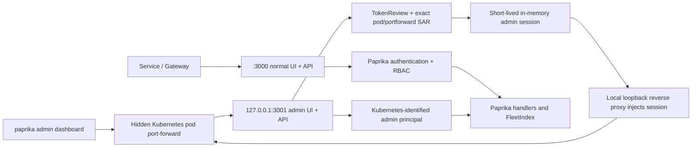

# Fleet Scope, Application Health Heatmap, and Port-Forward Admin Dashboard Design

## Goal

Complete the first enterprise-console increment by making fleet scope genuinely interactive, replacing the sampled dashboard application cards with a complete app-health heatmap, and adding a safe operator workflow that opens the console through Kubernetes port-forwarding without requiring Paprika credentials.

The finished experience must let an operator:

1. Narrow the fleet by project, cluster, stage, or namespace from the persistent shell.
2. Carry that scope between Overview, Applications, Releases, Rollouts, Pipelines, and their deep links.
3. See every authorized application in an app-health heatmap rather than an eight-card preview of the first query page.
4. Switch between Heatmap, Treemap, Matrix, Table, and Queue presentations without losing query state.
5. Run `paprika admin dashboard`, authenticate to Kubernetes using the active kubeconfig, and have Paprika discover a ready pod, establish a local-only port-forward, open the browser, and expose a visibly marked administrative session.
6. Validate the same UI locally with deterministic mocked Kubernetes objects and against the deployed `paprika-e2e` release through the admin port-forward.

This design extends the enterprise operations console described in `2026-07-11-enterprise-operations-console-design.md`. It does not replace the fleet index or introduce a second application inventory.

## Product Decisions

- Fleet scope is a global, URL-backed multi-select over Project, Cluster, Stage, and Namespace.
- Scope is filtering state, not an authorization boundary. The server still applies AppProject authorization before returning facet values, counts, map leaves, or list records.
- The dashboard health visualization is a true equal-cell heatmap: one cell per authorized, filtered Application. It is never derived from a paginated or sampled `QueryApplications` response.
- Heatmap color represents application health. Cell area is intentionally uniform. The existing Treemap remains the size-weighted view for managed-resource count or future request-rate weight.
- Applications gains `view=heatmap`; Treemap, Matrix, Table, and Queue remain available and share the same filters, search, grouping, sorting, and selection.
- Heatmap grouping supports Project, Cluster, Stage, Namespace, and Health. Cluster and Stage group an Application by its current actual target, so each Application still appears exactly once.
- Display controls are shareable URL state: presentation, grouping, density, label mode, sort, and direction.
- The admin dashboard is opt-in at the server/chart level and enabled for the `paprika-e2e` deployment. It uses a second pod-loopback listener and never weakens authentication on the normal UI/API listener.
- Kubernetes authentication plus `create` permission on `pods/portforward` for the exact selected Paprika pod is the administrative security boundary. The admin listener verifies both before minting a short-lived session. The CLI must say this plainly before opening the session and the UI must keep the session visibly marked.
- The admin listener is not placed in a Service, Ingress, Gateway API route, or declared public network destination. It is reachable only through a pod port-forward or from another process in the same pod network namespace, so loopback is transport isolation rather than sufficient authentication.
- Local mocked validation remains a first-class workflow and uses the real UI, Connect handlers, fleet index, query codecs, and generated Kubernetes-style fixtures.

## Current Problems

### Static fleet scope

`ui/src/components/layout/scope-bar.tsx` renders hard-coded text for “All projects”, “All clusters”, and “All stages”. It has no controls, no namespace segment, no URL integration, no facet data, and no change handlers. Applications contains separate working filters, but they are hidden below the page header and do not behave as persistent fleet scope. Sidebar links also discard scope on several routes.

### Sampled dashboard health cards

`DashboardHealthMap` receives the first impact-ranked `QueryApplications` page, renders no more than eight cards until expanded, and calculates filter totals from only those loaded records. With 250 mocked Applications, the header can say that 250 are indexed while the visualization represents only the first 100. That is an attention preview, not a fleet heatmap.

The existing `QueryFleetMap` path already returns every authorized filtered Application as one deterministic leaf. `FleetTreemap` already supplies Canvas rendering, hit testing, semantic zoom, keyboard navigation, and a health legend. Those are the correct foundations for a complete heatmap.

### No safe administrative console workflow

Port-forwarding the normal port 3000 reaches the production authentication interceptor and therefore still requires Basic/OIDC credentials. Disabling auth for port 3000 would also disable it for the Gateway/Service path. The repository has a local test fixture with auth disabled, but no in-cluster administrative listener, no session marker, and no `paprika admin dashboard` command.

## Information Architecture and User Experience

### Interactive fleet scope bar

The persistent scope bar contains four compact multi-select controls in this order:

- Projects
- Clusters
- Stages
- Namespaces

Each control shows `All <dimension>` when empty, the selected value for one item, and `<first> +N` for multiple items. Its popover includes type-ahead option filtering, authorized facet counts, checkboxes, “Select all visible”, and “Clear”. Unavailable values already present in a shared URL remain visible with an unavailable marker until the operator removes them; they are not silently discarded before facet loading completes.

The left side retains the “Fleet scope” label. A “Clear scope” action appears only when at least one global dimension is selected. On narrow screens, the controls remain usable through horizontal scrolling and appropriately sized popovers rather than collapsing to inert labels.

Project and Cluster values use their canonical `namespace/name` identities internally. A unique display name may be shown alone; collisions show the namespace. Stage and Namespace remain scalar values. Every option and trigger is keyboard operable and reports its selected state and result count to assistive technology.

### URL and navigation semantics

`ui/src/lib/fleet-query.ts` remains the canonical parser and serializer. Global scope uses the existing repeated `project`, `cluster`, `stage`, and `namespace` parameters. The following new presentation values are added:

- `view=heatmap`
- `density=auto|compact|comfortable`
- `labels=auto|all|none`
- `group=namespace`

Default values remain omitted from canonical URLs. `view=treemap` remains the Applications default unless a route explicitly chooses Heatmap. Overview uses Heatmap by default without rewriting the Applications default.

Changing scope patches only the four scope dimensions and clears state that is invalidated by a new result set: pagination cursor/page, selected map cell, and semantic zoom. It preserves search, health/sync/release/rollout/source filters, sort, direction, group, density, labels, time range, and presentation.

Route transitions merge canonical fleet parameters into their destination rather than reconstructing links ad hoc. Page identity parameters such as application namespace/name, release identity, rollout identity, pipeline identity, ApplicationSet identity, and active detail tab are never removed by scope serialization. Detail routes use dedicated keys (`application_namespace`/`application_name`, `rollout_namespace`/`rollout_name`, `pipeline_namespace`/`pipeline_name`, and `applicationset_namespace`/`applicationset_name`) so repeated global `namespace` values cannot be mistaken for resource identity.

Legacy `namespace`/`name` detail links remain readable only when there is exactly one `namespace` value and no explicit identity pair. Before the scope bar mutates such a URL, a route-aware migration performs one `replace`: it copies that single legacy identity into the route’s dedicated keys, removes legacy `name`, and then applies the new repeated fleet namespaces. A mixed URL with `name`, multiple legacy namespaces, and no explicit identity is reported as ambiguous rather than guessing. A detail page stays open when scope changes because scope does not supersede an explicitly addressed resource; its links back to fleet pages carry the new scope.

URL updates start with the current `URLSearchParams`, remove only fleet-owned keys plus known transient pagination/selection/zoom keys, and append the canonical replacement state. Every other parameter is retained. This is the mechanism—not a route-specific reconstruction—that preserves current and future page identity/tab parameters.

Applications removes duplicate ownership of Project, Cluster, Stage, and Namespace state. Its advanced filter panel continues to own Health, Sync, Release, Rollout, Source, search, and presentation-specific controls. It may summarize global scope, but editing a scope dimension always uses the same URL-backed state and facet source as the shell.

Overview and Applications apply all four scope dimensions through the common fleet query. Releases applies them through `QueryReleases`. Rollouts applies Namespace directly and applies Project/Cluster/Stage through its associated Application when that association is available; an unassociated Rollout is omitted from a non-empty unsupported scope rather than shown as a false match. The current dashboard Pipeline section applies Namespace and Project where present and preserves Cluster/Stage for navigation; expanding Pipeline into a dedicated fleet-query API is outside this increment. Every route preserves the complete scope even when its resource model can consume only a subset.

### Facets and loading behavior

The scope bar consumes authorized facets returned by the fleet query layer. It does not list Kubernetes objects directly from the browser. Facets retain the existing self-excluding behavior: every active filter except the facet’s own dimension contributes to that facet’s counts. This lets an operator widen one dimension without erasing the rest of the query.

The shell shares a small scope/facet data provider with fleet pages so the same route does not issue competing requests or maintain divergent React state. The provider supports cancellation and ignores out-of-order responses. While facets load, selected values remain interactive and the trigger shows a subtle loading state. A failed facet request leaves the current URL selection intact and provides a retry action; it never presents an empty list as authoritative.

### Complete app-health heatmap

Overview replaces the sampled `DashboardHealthMap` card grid with a compact `FleetHealthHeatmap` backed by `QueryFleetMap`. Applications exposes the same visualization as the `Heatmap` presentation. Both receive all authorized filtered leaves in one map response; neither synthesizes cells from a paginated applications list.

Every Application occupies one equal-sized cell. The default stable order within a group is health severity followed by namespace/name, so unhealthy cells are easy to scan while rerenders remain stable. Existing sort controls can change that order. The default grouping is Health on Overview and Project on Applications.

The heatmap offers:

- Grouping: Project, Cluster, Stage, Namespace, or Health.
- Density: Auto, Compact, or Comfortable.
- Labels: Auto, All, or None.
- Existing search and status filters.
- Presentation switcher: Heatmap, Treemap, Matrix, Table, or Queue.

Auto density chooses the largest cell size that shows the complete filtered set in the default viewport down to a six-pixel dense-fleet floor. When even that floor does not fit, Auto uses the same virtual internal scrolling as Compact and Comfortable; no density is allowed to omit cells. Compact favors fleet coverage. Comfortable favors readable names and metadata and usually requires internal scrolling. Auto labels show names only when cells meet the readable-size threshold; All forces labels with truncation; None shows health marks only.

Cells use the established health palette and reinforce color with a glyph/pattern so Healthy, Progressing, Degraded, Failed, Unknown, and Missing remain distinguishable without color perception. Group headers show application count and health distribution. The legend contains exact counts from the complete map result, not the first list page.

Pointer hover and keyboard focus reveal Application name/namespace, project, current cluster/stage, health, sync state, release/rollout state, managed-resource count, last transition, and the strongest available issue summary. Activating a cell opens Application detail while preserving the fleet query. The Escape key clears a selected cell; arrow keys move spatially; Enter opens the focused Application.

The heatmap uses Canvas for dense rendering and reuses the treemap’s established hit-testing and keyboard model. Every density uses a virtual scroll extent when its full geometry exceeds the viewport and repaints only visible Canvas bands rather than allocating an unbounded-height bitmap. A synchronized virtual semantic representation exposes the active cell, group summaries, counts, and a route to the complete Table view. The implementation must not create 10,000 interactive DOM nodes. Canvas geometry is deterministic for a given container, grouping, density, and ordered leaf set.

Geometry comes from one exported pure layout function whose result contains one stable-ID-tagged rectangle per input Application leaf. Unit tests compare the complete input/output ID multisets. The rendered Canvas host exposes only `data-heatmap-input-count`, `data-heatmap-layout-count`, and a deterministic digest of the sorted layout stable-ID multiset. Browser E2E intercepts the authorized `QueryFleetMap` response, computes the same expected count/digest from all application leaves, and compares it with those attributes. Duplicate or omitted geometry therefore fails without putting 10,000 interactive elements or raw identities into the DOM.

### Treemap relationship

Heatmap and Treemap are intentionally separate presentations:

- Heatmap answers “How is every app doing?” with equal visual weight.
- Treemap answers “Where is operational weight concentrated?” with area based on managed resources or request rate.

Changing between them preserves query, grouping, selection where the Application is still present, label mode, and sort. Density affects Heatmap only. Size metric affects Treemap only. The UI does not label the Treemap as a heatmap.

## Fleet Query Changes

The existing `QueryFleetMap` response remains the source for both visualizations. It already returns each Application once and groups Stage/Cluster by the current actual target. Extend its group enum and internal `GroupDimension` with Namespace. Namespace grouping uses `Application.Identity.Namespace`, with `Unassigned` only for malformed fixture/internal data; valid Kubernetes Applications always have a namespace.

No new paginated “fetch all” loop is introduced. The map response is the bounded aggregate payload designed for the fleet Canvas. Authorization, search, and all filters run before grouping or counts. Existing generation semantics and request-rate fallback remain unchanged.

Heatmap display preferences are client concerns and do not change the RPC request shape. The API returns semantic leaves and groups; the browser calculates equal-cell geometry. Extend application leaves with compact `FleetMapApplicationMetadata` containing project, current stage/cluster, sync, release/rollout state, drift/missing/resource counts, and last transition. This supports the promised tooltip without fetching a paginated list or duplicating every target in `ApplicationSummary`. Generated Go/TypeScript bindings change for the Namespace enum and optional leaf metadata; older clients safely ignore the new field.

Dashboard summary cards and the heatmap may share one fleet-map request when their scope/search/filter/group requirements match. The existing impact-ranked `QueryApplications` request remains appropriate for the separate attention queue and must not supply heatmap counts.

## Port-Forward Admin Dashboard

### Server topology

When enabled, API-capable Paprika processes run two independent HTTP listeners:



The admin listener:

- Is disabled by default.
- Binds to the literal pod-loopback address `127.0.0.1:3001`.
- Rejects configuration that resolves to a wildcard or non-loopback address.
- Reuses the normal static UI, Connect service implementation, audit interceptor, fleet index, Kubernetes clients, readiness state, and event broker.
- Does not install the ordinary Paprika Basic/OIDC authenticator.
- Exposes a narrowly scoped `POST /admin/session/exchange` endpoint. It submits the caller's Kubernetes bearer credential to TokenReview, rejects Paprika's own ServiceAccount identity, and performs SubjectAccessReview for `create` on `pods/portforward` for this exact pod namespace/name.
- Learns its own pod namespace, name, UID, and ServiceAccount identity from required Downward API fields. Missing or inconsistent identity makes the exchange unavailable.
- Mints an opaque 256-bit random session stored only in process memory, bound to the reviewed Kubernetes username/groups and pod UID, with a ten-minute idle expiry and a thirty-minute absolute lifetime. Tokens are never logged or returned by `/admin/session`.
- Requires the opaque token in `X-Paprika-Admin-Session` on every UI asset, `/admin/session`, and Connect request other than `/healthz`, `/readyz`, and the exchange endpoint. Missing, expired, wrong-pod, or unknown tokens return Unauthenticated/401 rather than installing an admin context.
- Supports authenticated `DELETE /admin/session` revocation. Revocation removes the in-memory record immediately and is idempotent for an already-expired token.
- Treats a reviewed exchange carrying the current session header as rotation: creation of the replacement and invalidation of the prior token occur atomically before the new token is returned. A successful rotation leaves exactly one live record for that CLI session.
- Installs an internal admin-session interceptor only after token validation. It sets an unforgeable context marker and principal whose subject is `kubernetes:<reviewed-username>` and whose access mode is `kubernetes-port-forward-admin`.
- Uses an admin-aware Authorizer wrapper that allows all Paprika actions only when the validated private context marker is present; otherwise it delegates to the normal authorizer.
- Records mutating operations through the normal audit path with the reviewed Kubernetes subject and an `access_mode=kubernetes-port-forward-admin` attribute.
- Rejects non-loopback Host headers and cross-origin mutation requests to reduce DNS-rebinding and local-browser attack surface.
- Exposes `/admin/session` on the admin listener with a non-secret session description. The normal listener returns Not Found for that path.
- Keeps the current raw `/events` route fail-closed with an explicit Not Found response on both listeners until an authorized WatchEvents transport exists; the admin listener does not reintroduce the legacy unauthenticated stream.
- Mounts `/readyz` on the admin listener and evaluates the same fleet/index readiness checker as port 3000.

The CLI session header is caller-controlled transport input, but it is only a lookup key for a server-generated, pod-bound, expiring record. The privileged context marker and principal cannot be set directly by an HTTP header, cookie, query parameter, or protobuf field. A caller hitting port 3000 cannot exchange or present an admin session. Tests must prove that unauthenticated calls to the normal listener remain Unauthenticated, raw calls to 3001 without a valid session remain Unauthenticated, Paprika's own pod credential is rejected, and a reviewed session succeeds.

TokenReview and SubjectAccessReview are mandatory, not best-effort. The chart grants eligible API/manager ServiceAccounts only the review permissions required to validate presented identities; it does not grant them permission to port-forward. The selected human or automation identity must independently hold the exact pod subresource permission. Untrusted sidecars are prohibited for an admin-enabled pod: before exchange, the server reads its own Pod and requires the expected chart container allowlist, so a mutating webhook that adds an unapproved sidecar safely disables admin exchange. Tests also inventory the rendered pod containers. Loopback-capable outbound HTTP code is reviewed to ensure no caller-controlled path can attach the admin-session header. Even if SSRF reaches port 3001, it receives no privilege without a separate reviewed Kubernetes credential and session.

### Helm configuration

Add:

```yaml
adminDashboard:
  enabled: false
```

Enabling it adds the server argument, Downward API identity fields, and TokenReview/SubjectAccessReview permission required for the verified-session exchange. Version 1 fixes the remote listener at `127.0.0.1:3001`, preventing chart/CLI port-discovery drift; neither host nor remote port is a chart value. The chart does not add the port to any Service, HTTPRoute, Ingress, Gateway, NetworkPolicy ingress destination, or public endpoint. A declared container port is unnecessary for pod port-forwarding and is omitted.

The `paprika-e2e` test values enable the feature. Both monolithic/operator and split API-server templates support it; webhook, repo-server, and agent-only processes do not start the listener.

Chart rendering tests cover monolith/split and feature enabled/disabled. Structural assertions inspect eligible pod arguments, every declared container port, every Service port/targetPort, Ingress and HTTPRoute/Gateway backends, and NetworkPolicy ingress ports. They require the loopback-listener argument only in eligible enabled pods and reject any direct, named, or indirect public mapping to 3001.

### `paprika admin dashboard` CLI

Add an `admin dashboard` command to `cmd/paprika`. It uses client-go rather than invoking `kubectl`, so pod discovery and forwarding honor standard kubeconfig loading and contexts. The v1 session exchange requires a bearer-token-capable context: static bearer tokens and exec/OIDC plugins are supported. A client-certificate-only or request-signing context fails before opening the browser with guidance to use a short-lived OIDC/exec-token context; it is not silently downgraded to loopback trust.

Supported flags:

- `--kubeconfig`: explicit kubeconfig path.
- `--context`: context override.
- `--namespace`: namespace override; otherwise use the active context namespace and then `default`.
- `--release`: Helm release/instance label when more than one Paprika installation is present.
- `--port`: local port, default `0` for an available ephemeral port.
- `--no-open`: establish the port-forward and print the URL without launching a browser.
- `--timeout`: pod discovery, port-forward, and readiness timeout, default 30 seconds.

The command workflow is:

1. Load and validate Kubernetes REST configuration.
2. Discover Paprika pods by standard chart labels, preferring ready split API-server pods and falling back to a ready monolithic manager pod.
3. Exclude terminating/unready pods. Prefer the newest ready pod during a rollout, with pod name as deterministic tie-breaker.
4. If discovery is ambiguous across releases and `--release` is absent, stop and list the valid release names rather than guessing.
5. Require a successful SelfSubjectAccessReview for `create` on `pods/portforward` for the selected pod. Denied, unavailable, or indeterminate review is fatal.
6. Start a hidden client-go pod port-forward from an ephemeral loopback port to fixed remote port 3001, then poll its unauthenticated `/readyz`.
7. Using the kubeconfig's bearer/exec credential transport, call `/admin/session/exchange` through that hidden forward. The server independently performs TokenReview and exact SubjectAccessReview; the CLI never reads or prints the Kubernetes bearer token.
8. Receive the opaque admin session over the loopback forward and keep it only in memory.
9. Bind a local HTTP reverse proxy to `127.0.0.1`; `--port=0` selects its available ephemeral port. The proxy strips any caller-supplied admin-session header, injects its own token on upstream requests, and enforces loopback Host plus same-origin mutation policy.
10. Require `/admin/session` through the authenticated proxy to return the expected Kubernetes subject and access mode. If exchange/session validation fails, stop without opening a browser.
11. Print the selected context, namespace, pod, proxy URL, reviewed Kubernetes subject, and the warning that exact pod port-forward permission grants unrestricted Paprika administration.
12. Open `http://127.0.0.1:<proxy-port>/dashboard/` unless `--no-open` is set.
13. Every five minutes—before both the ten-minute idle expiry and thirty-minute absolute expiry—pause new proxy requests, repeat TokenReview/SAR, atomically rotate to a new session token, update the proxy, and resume. A failed refresh closes the proxy rather than serving with uncertain privilege.
14. On SIGINT/SIGTERM, context cancellation, refresh failure, or transport failure, attempt authenticated `DELETE /admin/session` while the tunnel is still available, then erase the local token and close listeners/goroutines. Revocation failure is reported; the bounded server TTL remains the final backstop.

The CLI never requests Paprika Basic/OIDC credentials, never changes cluster resources, and never creates a Kubernetes object, long-lived credential, or Service. It uses the Kubernetes credential already produced by the selected kubeconfig only for the verified exchange and keeps the resulting admin token in memory. Browser-launch failure is non-fatal: the proxy URL remains printed and the session stays active.

The existing global `--output` flag applies. Text output is human-oriented. `--output=json` writes one readiness object containing context, namespace, pod, proxy URL, reviewed Kubernetes subject, session expiry, and access mode to stdout after `/admin/session` succeeds; progress and warnings go to stderr. This is the stable automation contract used by deployment E2E. YAML is rejected for this long-running command rather than producing a partial stream.

### Admin-session presentation

The shell probes the same-origin `/admin/session` endpoint at startup. A 404 is the only result interpreted as an ordinary session. A successful marked response renders a persistent high-contrast banner:

> Kubernetes port-forward admin session · unrestricted Paprika access

The banner includes the reviewed Kubernetes subject and a concise reminder to stop the CLI when finished. It cannot be dismissed for the life of the page. Transport errors, timeouts, malformed responses, and 5xx responses render a persistent “Session security status unknown” warning and retry with bounded backoff until the endpoint returns either a valid marker or 404. The application never silently renders an unrestricted but unmarked session. Ordinary sessions receive explicit 404 and render no banner. The UI does not infer administrative access from localhost, a URL flag, or failed authentication.

## Local Mocked Kubernetes Workflow

`test/fleetconsole` remains the canonical local validation fixture. It serves the real exported UI and real Connect handlers against deterministic fake Kubernetes objects and an initialized FleetIndex. Its default 250-Application data set must populate enough projects, clusters, stages, namespaces, health states, releases, rollouts, and pipelines to exercise every scope and presentation.

The local fixture remains explicitly auth-disabled because it binds only to the developer-selected loopback address. It is not used as the in-cluster admin implementation. Documentation distinguishes:

- Local fixture: deterministic developer/testing environment.
- `paprika admin dashboard`: Kubernetes-verified, short-lived administrative session over a real pod port-forward.

The fixture provides a repeatable command that builds the static UI, builds/starts the Go fixture, waits for readiness, runs browser tests, and tears down only processes it started. Existing independently running fixtures are not killed.

## Error Handling and Resilience

- Invalid URL scope values produce the existing non-blocking query notices and remain removable.
- Scope/facet requests are cancellable; stale responses cannot overwrite newer selections.
- An empty scoped fleet renders the active scope summary and a one-click scope reset, not a generic “no data” state.
- A map query failure leaves other dashboard panels usable and provides Retry plus a Table-view fallback link.
- A Canvas rendering failure or unsupported environment offers the complete semantic Table view.
- Heatmap tooltips stay within the viewport and do not hide the focused cell permanently.
- The CLI reports separately: kubeconfig failure, unsupported credential form, discovery failure, ambiguous release, local or server-side RBAC denial, TokenReview failure, port-forward transport failure, admin listener disabled, exchange/session failure, refresh/revocation failure, readiness timeout, and browser-launch failure.
- If the selected pod terminates during a rollout, the command exits with a specific reconnect instruction. Automatic migration between pods is deferred because silently moving an unrestricted session complicates audit identity and failure diagnosis.
- Admin server shutdown participates in the existing process context and graceful shutdown timeout. Failure to bind an enabled admin listener fails process startup rather than pretending the feature is available.

## Security Model

The admin workflow deliberately bypasses Paprika authentication but never treats loopback reachability as identity. It verifies the kubeconfig bearer identity through Kubernetes TokenReview and verifies exact-pod port-forward authorization through SubjectAccessReview before creating a bounded session. Anyone holding that Kubernetes identity and permission can obtain unrestricted Paprika access for the bounded session lifetime. Operators must grant `pods/portforward` narrowly and treat it as an administrative permission.

Security invariants:

1. Port 3000 behavior is byte-for-byte independent of whether the admin listener is enabled.
2. The admin listener binds only to pod loopback.
3. No Kubernetes Service or route selects the admin port.
4. Raw access to port 3001 grants no Paprika capability; a Kubernetes-reviewed, pod-bound, unexpired, non-revoked server session is required.
5. Paprika's own ServiceAccount and untrusted sidecars cannot bootstrap an admin session.
6. Admin identity comes only from a validated server session and private context, never directly from caller claims.
7. Audit records distinguish port-forward administration and preserve the reviewed Kubernetes username.
8. The CLI binds both hidden forward and browser proxy only to local loopback, uses random ports by default, and strips caller-supplied session headers.
9. The browser displays the unrestricted-session banner continuously.
10. Helm defaults the feature off.
11. The live `paprika-e2e` rollout explicitly enables it and validates that its public endpoint still challenges unauthenticated users.

Disabling authentication on the normal listener, trusting a forwarded HTTP header, or exposing the admin listener through a Service are explicitly rejected designs.

## Testing Strategy

### Unit and component tests

- Fleet query codec accepts/canonicalizes `view=heatmap`, Namespace grouping, density, and label mode.
- Scope patches preserve unknown/page identity parameters and non-scope fleet state while clearing selection, zoom, and pagination.
- Scope controls support multi-select, filtering, clearing, unavailable values, loading, errors, keyboard operation, and facet counts.
- Sidebar and cross-page links retain global scope.
- `QueryFleetMap` Namespace grouping returns every authorized Application exactly once with deterministic ordering, compact leaf metadata, and correct counts.
- Heatmap layout is deterministic, equal-area within a density, complete for all map leaves, responsive, and spatially keyboard navigable.
- Heatmap unit tests compare the full input/output stable-ID multiset; browser tests compare the intercepted map-leaf count/digest with the rendered layout count/digest.
- Dashboard counts come from map totals/buckets and cannot regress to paginated list counts.
- Admin bind validation rejects wildcard and non-loopback addresses.
- Public and admin Connect stacks prove normal Unauthenticated, raw-admin Unauthenticated, own-ServiceAccount exchange denial, reviewed-session success/idle expiry/absolute expiry/wrong-pod/revocation denial, atomic rotation invalidating the old token, authorized project enumeration, and a mutating audited action attributed to the Kubernetes subject.
- Host/origin checks reject non-local and cross-origin admin requests.
- CLI tests use injected Kubernetes, credential, exchange, port-forward, reverse-proxy, readiness, and browser interfaces for discovery preference, ambiguity, local/server RBAC denial, credential incompatibility, five-minute rotation, atomic old-token invalidation, best-effort revocation, caller-header stripping, ephemeral ports, readiness validation, `--no-open`, signals, and cleanup.
- Helm structural tests prove no container-port, Service/targetPort, route backend, or NetworkPolicy exposure.

### Local browser E2E

Against the 250-Application fixture, Playwright validates:

- Scope Project/Cluster/Stage/Namespace changes counts and all visible cells belong to the selected scope.
- Scope persists through Overview, Applications, Releases, Rollouts, Pipelines, and back navigation.
- Dashboard Heatmap represents the complete filtered map, not eight or one hundred Applications.
- Heatmap/Treemap/Matrix/Table/Queue toggles preserve scope, search, and display options.
- Group, density, label, health filter, search, hover/focus, keyboard navigation, and Application drill-down work.
- Empty, loading, and failed-query states remain actionable.
- Desktop, tablet, and 390px mobile layouts have no clipped critical controls or unintended page-level horizontal overflow.
- Browser console contains no uncaught errors and key API requests complete successfully.

CI runs both the main fleet suite and the responsive suite rather than leaving responsive coverage as a local-only command.

### In-cluster E2E

A deployment-level script ensures an isolated, labelled E2E data set exists before browser validation: at least one Application in each exercised health state plus an associated Release, Rollout, and Pipeline. It may reuse matching pre-existing fixtures; otherwise it applies deterministic objects in a dedicated test namespace and removes only objects carrying its run label during cleanup. The script waits until those resources are indexed and queryable.

The script then owns the `paprika admin dashboard --no-open --output=json` subprocess, waits for its readiness object, runs Playwright against that base URL, and always tears down the subprocess. On failure it captures pod logs, rendered chart evidence, browser traces, screenshots, API responses, and the seeded-object readiness report.

The suite validates Overview, Applications Heatmap/Treemap/Matrix/Table/Queue, Releases, Rollouts, Pipelines, Application detail, and the admin banner at desktop and mobile widths. It also issues an unauthenticated Connect request to the normal port/public endpoint and requires Unauthenticated while the admin-forwarded equivalent succeeds.

## Rollout Plan and Acceptance Criteria

Implementation is developed from the current enterprise-console head on an isolated `issue/` branch. Before deployment:

- Go unit/integration tests pass.
- UI unit tests, type checks, lint, production export, and fleet browser suites pass.
- Helm lint/template tests pass.
- The local 250-Application fixture is inspected in a real browser at desktop and mobile sizes.

Build the deployment image for `linux/amd64`. Prefer the repository’s GitHub Actions GHCR path when the implementation is integrated; for immediate branch validation, use a uniquely tagged temporary `ttl.sh` image. Upgrade `paprika-e2e` with `adminDashboard.enabled=true`, wait for workloads and fleet index readiness, and keep normal auth enabled.

The increment is accepted only when all of the following are demonstrated:

1. Fleet scope controls visibly and correctly change the represented data.
2. Scope survives navigation across all fleet views and resource inventories.
3. The app-health heatmap has one cell per authorized filtered Application and exact complete counts.
4. Operators can switch presentation, grouping, density, and labels without losing scope/search.
5. `paprika admin dashboard` finds the deployed pod, verifies Kubernetes identity and exact port-forward permission, creates a bounded session over a local-only port-forward, verifies the admin marker, and opens or prints the proxy URL.
6. The dashboard visibly identifies the unrestricted admin session.
7. All specified views render and function through that port-forward.
8. The normal listener remains authenticated and the admin port is absent from Services and routes.
9. Tests, screenshots/traces, deployment status, and image identity are recorded in the implementation handoff.

## Alternatives Considered

### Page-local scope and reuse of port 3000

This would make the current Applications filters prettier and teach the CLI to forward the normal UI port. It is smaller, but scope would still fragment between pages and the CLI could not bypass Basic/OIDC without collecting Paprika credentials. It does not satisfy the requested operator workflow.

### Kubernetes authentication provider on the normal listener

The normal public API could accept Kubernetes bearer tokens as a general Paprika authentication provider and map Kubernetes identities to scoped Paprika RBAC. That remains valuable, but it is a broader product-level auth integration than this explicit, exact-pod, unrestricted admin workflow. This increment keeps Kubernetes credential exchange available only on the unserved loopback listener.

### Trust raw pod-loopback reachability

The simpler listener could install an administrator for every connection reaching `127.0.0.1:3001`. That is rejected because same-pod processes, untrusted sidecars, and SSRF-capable outbound paths can also reach pod loopback without exercising Kubernetes port-forward authorization. Loopback remains a transport constraint, while TokenReview, exact SubjectAccessReview, and the short-lived server session provide the identity boundary.

### Disable auth or trust a header on port 3000

This is operationally simple and unsafe. The same listener is exposed by the Service/Gateway, and a trusted header is forgeable unless every proxy boundary is tightly controlled. Both variants are rejected.

## Non-Goals

- Replacing AppProject authorization or Kubernetes RBAC.
- Adding saved fleet views or user preference persistence outside the URL.
- Building arbitrary metrics dashboards or implementing the Prometheus provider in this increment.
- Making the admin listener remotely reachable.
- Keeping a browser-usable admin session after the CLI proxy exits.
- Automatic port-forward failover between pods.
- Redesigning Pipeline, Release, Rollout, Repository, Registry, or Observability Source domain models.
- Enabling every fleet-level mutating action. Existing capability-gated detail actions remain authoritative; the scope/heatmap increment focuses on visibility and navigation.
